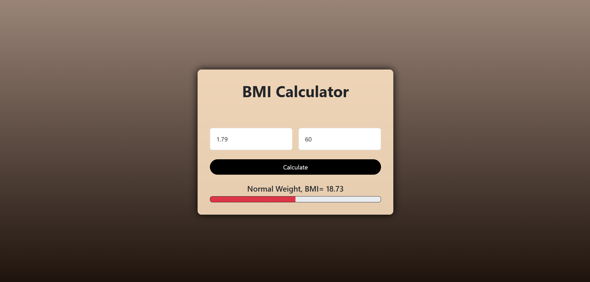

# 🧮 BMI Calculator (JavaScript)

A simple **Body Mass Index (BMI)** calculator built using **HTML, CSS, and JavaScript**.  
This tool lets users enter their weight and height to instantly calculate their BMI and check their health category.

---

## 📸 Preview
  
  

*(Replace `assets/screenshot.png` with your actual image path or link)*

---

## ✨ Features
- 🖱️ **Easy to use** – Just enter your height & weight
- ⚡ **Instant result** – No page reloads
- 📊 **BMI category detection** – Underweight, Normal, Overweight, Obese
- 🎨 **Responsive design** – Works on desktop and mobile
